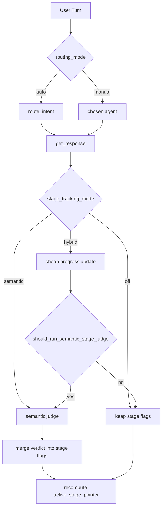

# Hybrid Stage Tracking Plan

## What I Found

- Routing mode is not persisted as a backend setting today. The frontend keeps `autoRoutingOn` in [`presentation/static/modules/state.js`](presentation/static/modules/state.js), and [`presentation/static/modules/interview_chat_panel.js`](presentation/static/modules/interview_chat_panel.js) chooses either `POST /api/sessions/<id>/send` for auto routing or `POST /api/sessions/<id>/send-manual` for manual routing.
- Auto routing happens only in [`core/use_cases/conduct_interview_turn.py`](core/use_cases/conduct_interview_turn.py): it calls `route_intent(...)`, then applies `apply_sequential_stage_veto(...)`.
- Manual routing is already separate in [`core/use_cases/conduct_manual_interview_turn.py`](core/use_cases/conduct_manual_interview_turn.py): it never calls `route_intent(...)`, but it does currently call `stage_completion_judge` for agents 1-4.
- Stage completion judge calls are in both turn use cases, after the assistant reply is persisted. Agent 5 is already skipped in the manual path.
- Stage flags and the active stage pointer are stored on `sessions`: `current_agent_id` is the active stage pointer, and `stage1_complete` through `stage4_complete` hold completion flags. [`core/entities/stage_evaluator.py`](core/entities/stage_evaluator.py) owns `earliest_unfinished_stage(...)`, the routing veto, the old count heuristic, and verdict merging.
- Settings use SQLite `config` keys. Model registry and router model are persisted by [`infrastructure/persistence/sqlite_model_registry_store.py`](infrastructure/persistence/sqlite_model_registry_store.py) and exposed through [`presentation/gemini_connection_routes.py`](presentation/gemini_connection_routes.py). The Settings UI reads them in [`presentation/static/modules/settings_agent.js`](presentation/static/modules/settings_agent.js).
- There is no existing per-session metadata or stage progress table/column. The smallest consistent persistence change is a `sessions.stage_progress` JSON column, read and written through the existing turn-store port.

## Rule Fit Check

- Architecture: keep this as a vertical slice through `core/`, `infrastructure/`, `presentation/`, and `bootstrap.py`. `core/` gets pure shapes, pure rules, and ports only. SQLite stays in `infrastructure/`. Flask and browser code stay in `presentation/`.
- Import direction: `core/` must not import SQLite, Flask, `bootstrap`, or browser code. `bootstrap.py` is the only composition root and wires adapters into use cases.
- Naming: use repo words that say the behavior out loud: `stage_tracking`, `stage_progress`, `interview_session`, `turn`, `settings`, `adapter`, and `route`. Do not add generic `manager`, `service`, or `helper` files.
- Simplicity: keep the judge contract unchanged. Add only one per-session JSON column and only the small config keys needed for the mode and interval.
- Presentation: route handlers should parse input, call a bootstrap-wired use case, and return JSON. Do not put stage completion rules or settings validation in Flask routes or JavaScript.
- Docs and verification: update `DEV-STANDALONE.md` because behavior changes, then run `pytest -q` and `python run_dev.py --smoke`.

## Proposed Design

Keep routing and stage tracking as separate decisions:

- Add `stage_tracking_mode` with values `off`, `hybrid`, and `semantic`; default to `hybrid`.
- Add `stage_tracking_judge_interval` as a configurable integer, default `4` turns since the last judge for that stage.
- Add compact progress per session and stage, stored as JSON in `sessions.stage_progress`. Core-facing code should call this `stage_progress_json` or `serialized_stage_progress` so it is clear the DB stores JSON and the core rules operate on typed progress.
- Add pure core helpers, probably in a new [`core/entities/stage_progress.py`](core/entities/stage_progress.py), so both auto and manual use cases share the same rules.
- In `hybrid`, every eligible user turn updates compact progress for the target stage when the target agent is 1-4, but only the semantic judge can flip a stage flag complete.
- In `semantic`, preserve current behavior: judge every eligible agent 1-4 turn.
- In `off`, do not update progress and do not call the judge automatically.
- Keep agent 5 behavior: never call the stage judge and never flip stage flags from an agent 5 turn.

## Plan Slices

### Slice 1: Backend Stage Tracking Contract

**Goal:** Ship the behavior contract without adding frontend controls. Hybrid mode exists, is persisted, works in auto and manual routing, and runs the semantic judge only when the helper says it is needed. Final report/export requests still get the required semantic review trigger.

**In scope:**

- Pure core stage tracking settings, compact progress, evidence rules, and judge gate rules.
- SQLite config persistence for `stage_tracking_mode` and `stage_tracking_judge_interval`.
- SQLite session progress persistence through `sessions.stage_progress`.
- Bootstrap wiring.
- `GET/PUT /api/config/stage-tracking` so settings are scriptable and ready for Slice 2.
- Auto and manual turn behavior.
- Eligible final report/export refresh.
- Focused tests, `DEV-STANDALONE.md`, `pytest -q`, and `python run_dev.py --smoke`.

**Out of scope:**

- Settings UI card.
- Debug/observability display.
- Prompt changes, model changes, hidden response contracts, or broad refactors.

#### Slice 1 Steps

1. Re-read the current touch points.
   - Read [`core/use_cases/conduct_interview_turn.py`](core/use_cases/conduct_interview_turn.py), [`core/use_cases/conduct_manual_interview_turn.py`](core/use_cases/conduct_manual_interview_turn.py), [`core/entities/stage_evaluator.py`](core/entities/stage_evaluator.py), [`core/entities/interview_turn.py`](core/entities/interview_turn.py), [`core/ports/interview_session_turn_store.py`](core/ports/interview_session_turn_store.py), [`infrastructure/persistence/sqlite_interview_session_turn_store.py`](infrastructure/persistence/sqlite_interview_session_turn_store.py), [`infrastructure/persistence/orchestrator_sqlite_bootstrap.py`](infrastructure/persistence/orchestrator_sqlite_bootstrap.py), [`bootstrap.py`](bootstrap.py), [`presentation/gemini_connection_routes.py`](presentation/gemini_connection_routes.py), and [`presentation/static/modules/settings_agent.js`](presentation/static/modules/settings_agent.js).
   - Confirm there are no new user edits in those files before editing.

2. Add the pure settings shape.
   - In [`core/entities/stage_progress.py`](core/entities/stage_progress.py), add `StageTrackingMode = Literal["off", "hybrid", "semantic"]`.
   - Add frozen `StageTrackingSettings(mode: StageTrackingMode = "hybrid", judge_interval_turns: int = 4)`.
   - Add `normalize_stage_tracking_settings(mode: str | None, judge_interval_turns: int | str | None) -> StageTrackingSettings` that clamps the interval to at least `1` and defaults unknown modes to `hybrid`.

3. Add the pure progress shapes.
   - In the same core file, add frozen `StageProgress` with `user_message_count`, `meaningful_evidence_count`, `status`, `last_judged_user_message_count`, and `latest_evidence_excerpt`.
   - Add `SessionStageProgress` as a typed mapping for stages `1..4`.
   - Add parse/serialize functions for the compact JSON string. Invalid or empty JSON should return empty progress for all four stages.

4. Add evidence rules.
   - Add `is_short_or_test_like_user_input(text: str) -> bool`.
   - Add `is_meaningful_stage_evidence(text: str) -> bool`.
   - Keep the first version literal and conservative: short strings, greetings, and test strings are not meaningful; longer concrete text is meaningful.

5. Add progress update rules.
   - Add `update_stage_progress_from_user_evidence(stage_id, text, session_progress) -> SessionStageProgress`.
   - Increment `user_message_count` only for the target stage when `stage_id` is `1..4`.
   - Increment `meaningful_evidence_count` only when the text passes the meaningful evidence rule.
   - Set `status` to `candidate_complete` only after at least two meaningful evidence messages for that stage.
   - Never update progress for agent 5.

6. Add judge gate rules.
   - Add frozen `StageJudgeRunDecision(should_run: bool, reason: str)`.
   - Add `user_requested_stage_advance(text: str) -> bool`.
   - Add `user_requested_final_report_or_export(text: str) -> bool`.
   - Add `should_run_semantic_stage_judge(stage_id, text, settings, progress, stage_flags) -> StageJudgeRunDecision`.
   - In `hybrid`, return false when there are fewer than 2 user messages, no meaningful evidence, or the message is short/test-like.
   - In `hybrid`, return true for `candidate_complete`, explicit advance, final report/export wording, or interval expiry.
   - In `semantic`, return true for eligible stages.
   - In `off`, return false.

7. Test the pure core rules.
   - Add tests in [`tests/test_core_entities.py`](tests/test_core_entities.py) or a new [`tests/test_stage_progress.py`](tests/test_stage_progress.py).
   - Cover default settings, invalid settings fallback, short/test-like input, meaningful evidence, `candidate_complete`, interval expiry, `semantic`, `off`, and agent 5 ignored.

8. Add the settings port.
   - Create [`core/ports/stage_tracking_settings_store.py`](core/ports/stage_tracking_settings_store.py).
   - Define `get_stage_tracking_settings() -> StageTrackingSettings`.
   - Define `set_stage_tracking_settings(settings: StageTrackingSettings) -> StageTrackingSettings`.

9. Add settings use cases.
   - Create [`core/use_cases/read_stage_tracking_settings.py`](core/use_cases/read_stage_tracking_settings.py).
   - Create [`core/use_cases/update_stage_tracking_settings.py`](core/use_cases/update_stage_tracking_settings.py).
   - Keep both use cases small: read from the port, or normalize request values and write through the port.

10. Add the SQLite settings adapter.
   - Create [`infrastructure/persistence/sqlite_stage_tracking_settings_store.py`](infrastructure/persistence/sqlite_stage_tracking_settings_store.py).
   - Store `stage_tracking_mode` and `stage_tracking_judge_interval` in the existing `config` table.
   - Use the core normalization function before returning settings.

11. Add the per-session progress column.
    - Update [`infrastructure/persistence/orchestrator_sqlite_bootstrap.py`](infrastructure/persistence/orchestrator_sqlite_bootstrap.py).
    - Add `stage_progress TEXT DEFAULT ''` to new `sessions` rows.
    - Add an idempotent `ALTER TABLE sessions ADD COLUMN stage_progress TEXT DEFAULT ''` for existing databases.

12. Carry progress through the turn context.
    - Add `stage_progress_json: str = ""` to `TurnContext` in [`core/entities/interview_turn.py`](core/entities/interview_turn.py).
    - Add `stage_progress_json: str | None = None` to `update_session_state(...)` in [`core/ports/interview_session_turn_store.py`](core/ports/interview_session_turn_store.py).
    - Update [`infrastructure/persistence/sqlite_interview_session_turn_store.py`](infrastructure/persistence/sqlite_interview_session_turn_store.py) to select and update `stage_progress`.

13. Wire settings in bootstrap.
    - In [`bootstrap.py`](bootstrap.py), instantiate `SqliteStageTrackingSettingsStore`.
    - Wire `read_stage_tracking_settings` and `update_stage_tracking_settings` use cases.
    - Pass that store into `ConductInterviewTurn`, `ConductManualInterviewTurn`, and any report/export refresh use case added in this slice.
    - Do not read settings from globals inside `core/`.

14. Update auto turn behavior.
    - In [`core/use_cases/conduct_interview_turn.py`](core/use_cases/conduct_interview_turn.py), keep `route_intent(...)` exactly in the auto path.
    - After the assistant message is appended, parse current `stage_progress_json`, update progress for `target_agent_id`, read `stage_tracking_mode`, and call the judge only when the helper says yes.
    - If the judge is skipped, keep `new_flags = dict(ctx.stage_flags())`.
    - Always persist the updated compact progress and recomputed active stage pointer.

15. Update manual turn behavior.
    - In [`core/use_cases/conduct_manual_interview_turn.py`](core/use_cases/conduct_manual_interview_turn.py), keep manual routing independent of `route_intent(...)`.
    - Keep the agent 5 branch first: do not update progress, do not call the judge, and do not flip flags.
    - For agents 1-4, apply the same stage tracking helper path as auto turns.

16. Add the settings API.
    - Create [`presentation/stage_tracking_settings_routes.py`](presentation/stage_tracking_settings_routes.py).
    - Add `GET /api/config/stage-tracking` returning `mode` and `judge_interval_turns`.
    - Add `PUT /api/config/stage-tracking` that passes raw request values to `bootstrap.update_stage_tracking_settings` and returns the saved settings.
    - Register the route in [`presentation/app.py`](presentation/app.py).

17. Refresh before final report and export.
    - Add a narrow core use case or small shared core function that checks stages `1..4` and runs the semantic judge only when settings and progress say it should.
    - Call it before [`core/use_cases/finalize_interview_session.py`](core/use_cases/finalize_interview_session.py) generates payloads.
    - Call it before [`presentation/interview_session_routes.py`](presentation/interview_session_routes.py) returns `/api/sessions/<id>/export`, through a wired use case from `bootstrap.py`.

18. Test the backend contract.
    - Add [`tests/test_stage_tracking_turns.py`](tests/test_stage_tracking_turns.py) with small in-memory fakes for the turn store, LLM gateway, settings store, and judge.
    - Test auto routing plus hybrid skips the judge on an early turn.
    - Test manual routing plus hybrid writes updated stage progress.
    - Test semantic mode calls the judge for an eligible stage turn.
    - Test manual agent 5 does not call the judge and does not change stage flags.
    - Test compact progress cannot mark a stage complete by itself.
    - Test final report/export refresh calls the judge only when the gate says yes.

19. Update docs.
    - Update [`DEV-STANDALONE.md`](DEV-STANDALONE.md) stage completion section.
    - Say plainly that routing mode chooses the agent, while stage tracking mode controls progress tracking.
    - Say plainly that manual routing still tracks stage progress unless stage tracking is `off`.

20. Verify.
    - Run `pytest -q` from the repo root.
    - Run `python run_dev.py --smoke` from the repo root.
    - Report both results and any remaining risk.

### Slice 2: Frontend Settings And Observability

**Goal:** Add browser controls and a small amount of visibility on top of the Slice 1 backend. This slice should not change the stage tracking rules.

**In scope:**

- Settings UI for `stage_tracking_mode`.
- Settings UI for `stage_tracking_judge_interval`.
- Optional lightweight visibility for the current mode or latest judge skip/run reason.
- Focused browser smoke checks.

**Out of scope:**

- Any changes to core judge gating rules.
- Any changes to the `InterviewStageCompletionJudge` adapter contract.
- Any new report/export behavior.

#### Slice 2 Steps

1. Re-read the Slice 1 API shape.
   - Confirm `GET /api/config/stage-tracking` and `PUT /api/config/stage-tracking` response fields.
   - Confirm no frontend code owns stage tracking rules.

2. Add the settings card.
   - In [`presentation/static/modules/settings_agent.js`](presentation/static/modules/settings_agent.js), read `/api/config/stage-tracking` in `renderAgentSettings()`.
   - Add a small Stage Tracking card near the Router Model card.
   - Add a mode select with `Hybrid`, `Semantic`, and `Off`.
   - Add a number input for the judge interval.
   - Add `saveStageTrackingSettings()`.

3. Bind the save handler.
   - Export the save handler from [`presentation/static/modules/settings_agent.js`](presentation/static/modules/settings_agent.js).
   - Bind it from [`presentation/static/modules/settings.js`](presentation/static/modules/settings.js).
   - Keep the route call thin: send raw form values and show the saved response.

4. Add optional visibility only if it stays small.
   - Prefer a small text line in Settings, such as `Hybrid: judge after candidate completion, explicit advance, final report/export, or interval`.
   - Do not add a new panel unless the backend already returns useful data without new product rules.

5. Verify Slice 2.
   - Run `pytest -q` if Python files changed.
   - Run `python run_dev.py --smoke` if bootstrap or routes changed.
   - Manually open Settings, change the stage tracking mode, save, close Settings, reopen Settings, and confirm the saved value appears.

## Non-Goals

- Do not change Gemini model selection or prompt content.
- Do not change the `InterviewStageCompletionJudge` adapter contract.
- Do not persist `routing_mode`; the current frontend endpoint split already represents auto vs manual for each turn.
- Do not let compact progress mark a stage complete. It only decides whether the semantic judge is worth calling.