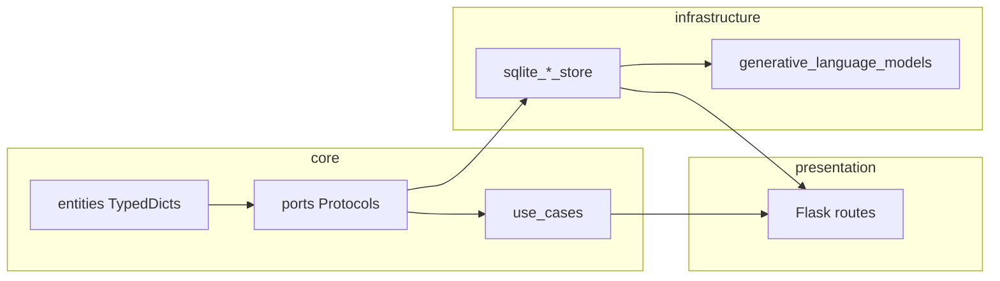

# Preliminary plan: tighten typing in `core/ports`

## Vertical slices and planning levels

**Mental model (hex + VSA-style):** One **engineering slice** = one **driven port** and its **main adapter** (here, SQLite), plus the **wire types** in `core/entities` and **direct callers** (routes / use cases). You are hardening a single boundary spoke, not “the ports folder” as a layer-only edit. That matches “port to adapter” crossing the hex boundary; product-style “one UI feature” is a different slice shape and is optional here.

**How many slices for this work:** **Three** if you ship agents, prompt templates, and model registry. **Four** if you add the optional session-importer pass (or **three + deferred** importer). Loosely: **Slice 1** = agent settings row, **Slice 2** = prompt templates, **Slice 3** = model registry, **Slice 4 (optional)** = import JSON.

**Two-level planning:** **This file** = umbrella + **locked decisions** (field lists, `update_template` shape). **Frontmatter atomic todos** = one coding-agent step each; agent implements and tests, does not replan.

## Atomic todos — planner vs coding agent

**Resolve in planning (reasoning here, not during implementation):**

- TypedDict **key sets** and **`NotRequired`** / `total=False` — derive from [`SqliteAgentConfigurationStore.list_agents`](orchestrator_v4/infrastructure/persistence/sqlite_agent_configuration_store.py), [`prompt_templates`](orchestrator_v4/infrastructure/persistence/sqlite_prompt_template_store.py) columns, [`_DEFAULT_REGISTRY` / `_validate_models`](orchestrator_v4/infrastructure/persistence/sqlite_model_registry_store.py).
- **Slice 1 adapter rule (locked):** `SqliteAgentConfigurationStore.list_agents` should build explicit dicts matching `AgentSettingsRow`. If `is_synthesizer` comes back from SQLite as `0/1`, normalize it in the adapter rather than lying with a cast.
- **Slice 2 update API (locked):** Introduce **`PromptTemplateUpdateFields`** (`TypedDict`, `total=False`) with keys `name`, `description`, `content`, `target_agent_id`. Port: `update_template(self, template_id: int, fields: PromptTemplateUpdateFields) -> ...` replacing `**fields: Any`. Implementation keeps the same SQL branch logic; route builds `fields` dict from JSON keys present; use case passes that one object end-to-end.
- **Slice 3 required/optional keys (locked):** `ModelRegistryEntry` required vs optional fields must match what [`_validate_models`](orchestrator_v4/infrastructure/persistence/sqlite_model_registry_store.py) accepts and what real loaded rows contain. Do not make a key required just because `_DEFAULT_REGISTRY` currently includes it.

**Coding agent:** One atomic todo = small edit surface; **no behavior change** unless the todo says so; run **pytest after S1, after S2, and after S3**. If the repo has a configured type checker, run it on touched paths before declaring the slice done.

**Acceptance:**

| Slice | Done when |
|-------|-----------|
| S1 | `list_agents` is `list[AgentSettingsRow]` end-to-end; routes unchanged at runtime; tests green. |
| S2 | Template CRUD typed; port has no `Any` on update; route/use case/store pass one `fields` object; tests green. |
| S3 | Registry + glm + gemini routes typed; `save_models` receives typed data only after parse/validation; tests green. |
| S4 | Chosen option applied (defer / shallow / doc-only). |

## Current state (from review)

- **Strong:** Ports that already return entity types ([`interview_session_read_port.py`](orchestrator_v4/core/ports/interview_session_read_port.py), [`interview_session_turn_store.py`](orchestrator_v4/core/ports/interview_session_turn_store.py), [`interview_session_catalog.py`](orchestrator_v4/core/ports/interview_session_catalog.py), [`interview_llm_gateway.py`](orchestrator_v4/core/ports/interview_llm_gateway.py), etc.) need little or no change.
- **Weak:** Four areas still use `list[dict]`, `dict[str, Any]`, or `**fields: Any`:
  - [`model_registry_store.py`](orchestrator_v4/core/ports/model_registry_store.py) — `list[dict]` for registry entries
  - [`agent_configuration_store.py`](orchestrator_v4/core/ports/agent_configuration_store.py) — `list[dict]` for Settings agent rows
  - [`prompt_template_store.py`](orchestrator_v4/core/ports/prompt_template_store.py) — template rows + loose `update_template(**fields: Any)`
  - [`interview_session_importer.py`](orchestrator_v4/core/ports/interview_session_importer.py) — `dict[str, Any]` for v3 export payloads

## Dependency surface (outside `core/ports/`)

| Area | Why it touches other folders |
|------|------------------------------|
| **Types live in `core/entities/`** | TypedDicts / protocols for “wire” shapes belong next to other domain types per [orchestrator-architecture](../../../.cursor/rules/orchestrator-architecture.mdc); ports import them. |
| **Infrastructure** | [`sqlite_model_registry_store.py`](orchestrator_v4/infrastructure/persistence/sqlite_model_registry_store.py), [`sqlite_agent_configuration_store.py`](orchestrator_v4/infrastructure/persistence/sqlite_agent_configuration_store.py), [`sqlite_prompt_template_store.py`](orchestrator_v4/infrastructure/persistence/sqlite_prompt_template_store.py) must return/accept the new types; [`generative_language_models.py`](orchestrator_v4/infrastructure/ai/generative_language_models.py) reads `get_models()`. |
| **Use cases** | [`prompt_template_catalog.py`](orchestrator_v4/core/use_cases/prompt_template_catalog.py) re-exports store return types — signatures should match the port. |
| **Presentation** | [`gemini_connection_routes.py`](orchestrator_v4/presentation/gemini_connection_routes.py) (`get_models` / `save_models`), [`agent_configuration_routes.py`](orchestrator_v4/presentation/agent_configuration_routes.py) (`list_agents`), [`prompt_template_routes.py`](orchestrator_v4/presentation/prompt_template_routes.py) (template CRUD). These mostly stay `jsonify(...)` / `request.get_json()`; typing changes are usually annotation + ensuring dicts satisfy TypedDict (runtime unchanged). |
| **Bootstrap** | [`bootstrap.py`](orchestrator_v4/bootstrap.py) likely unchanged. Explicit `class SqlitePromptTemplateStore(PromptTemplateStore)` is out of scope unless the checker requires it; [`SqliteModelRegistryStore`](orchestrator_v4/infrastructure/persistence/sqlite_model_registry_store.py) already inherits its ABC. |

**How involved:** **Medium** for registry + agents + templates if you add TypedDicts and fix call sites; **low** if you only tighten one subsystem first. **High effort / optional** for a fully typed v3 import tree.

## Recommended phases (incremental)

### Phase A — Quick wins (low risk)

1. **`AgentConfigurationStore.list_agents`:** Define e.g. `AgentSettingsRow` as `TypedDict` with keys matching what [`SqliteAgentConfigurationStore.list_agents`](orchestrator_v4/infrastructure/persistence/sqlite_agent_configuration_store.py) builds: `id`, `name`, `prompt_file`, `model`, `is_synthesizer`, `prompt`. Update port + implementation return annotations; [`agent_configuration_routes`](orchestrator_v4/presentation/agent_configuration_routes.py) gets clearer types with minimal logic change.
2. **`PromptTemplateStore`:** Define `PromptTemplateRow` `TypedDict` aligned with `SELECT * FROM prompt_templates` columns (use `NotRequired` / `total=False` only if SQLite may omit keys). Replace `list[dict[str, Any]]` / `dict[str, Any]` on port, [`sqlite_prompt_template_store`](orchestrator_v4/infrastructure/persistence/sqlite_prompt_template_store.py), and [`prompt_template_catalog`](orchestrator_v4/core/use_cases/prompt_template_catalog.py). For `update_template`, use the locked **`PromptTemplateUpdateFields`** `TypedDict` path from the section above; route + use case + store all pass one `fields` object instead of `**fields: Any`.
3. **Optional only if the type checker requires it:** `class SqlitePromptTemplateStore(PromptTemplateStore)` for explicit `Protocol` implementation.

### Phase B — Model registry (medium effort, highest structural complexity)

1. **`ModelRegistryStore`:** Introduce `ModelRegistryEntry` `TypedDict` (and possibly nested types for `temperature_range`, `output_modalities`) guided by [`_DEFAULT_REGISTRY`](orchestrator_v4/infrastructure/persistence/sqlite_model_registry_store.py), [`_validate_models`](orchestrator_v4/infrastructure/persistence/sqlite_model_registry_store.py), and what real loaded rows look like. Use `total=False` for keys that are legitimately optional in stored JSON.
2. Thread through [`SqliteModelRegistryStore`](orchestrator_v4/infrastructure/persistence/sqlite_model_registry_store.py), [`generative_language_models.py`](orchestrator_v4/infrastructure/ai/generative_language_models.py) (where it iterates models), and [`gemini_connection_routes.py`](orchestrator_v4/presentation/gemini_connection_routes.py). In routes, parse/validate request JSON before treating it as `list[ModelRegistryEntry]`.
3. Run **pytest** from repo root after Phase B and run the configured type checker too if present — this path is easy to break if TypedDict is stricter than persisted JSON.

### Phase C — Session importer (defer or narrow)

- **Full typing** of v3 `orchestrator_export` JSON implies nested `TypedDict`s for `session`, message lists, routing logs — large and brittle if the export format evolves.
- **Pragmatic options:** (1) leave `dict[str, Any]` on the port but document the expected top-level keys in the docstring; (2) add only a shallow `OrchestratorExportV3` with `session: dict[str, Any]` and nested structures still `Any`; (3) add runtime validation (e.g. small helper) separate from static types. Recommend **not** blocking Phases A–B on this.

## Verification

- Run existing tests (`pytest` at repo root) after S1, again after S2, and again after S3.
- Run the configured type checker you already use (for example `pyright` or `mypy`) on touched modules if the repo has config.

## Mermaid: where types flow

