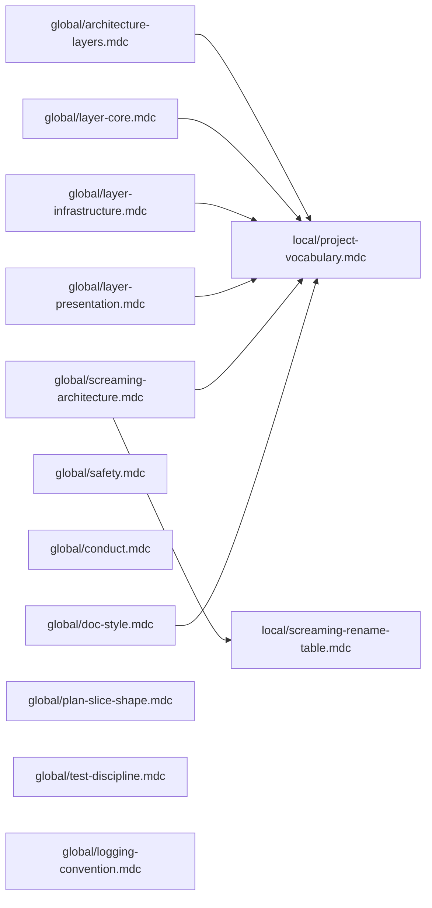

# Rules portability refactor (deferred — for a later session)

## Why

Current `.cursor/rules/*.mdc` are ~70% portable. Principles are sound but names leak: `orchestrator_v4` package name, `Flask`, `SQLite`, `Gemini`, domain nouns (`interview, session, turn, agent roster`), and a full rename table inside `orchestrator-screaming-presentation.mdc`. Copying the set into the next similarly shaped project forces edits across almost every file.

Fix: physical split into `global/` (no project nouns) and `local/` (this project's answers). All project-specific vocabulary lives in one file that global rules reference in the abstract.

Non-goal: changing application code. Codebase keeps its screaming names. Only the **rule text** travels.

## Proposed layout

```
.cursor/rules/
  global/
    architecture-layers.mdc          # from orchestrator-architecture.mdc, nouns stripped
    layer-core.mdc                   # from orchestrator-layer-core.mdc, nouns stripped
    layer-infrastructure.mdc         # from orchestrator-layer-infrastructure.mdc, nouns stripped
    layer-presentation.mdc           # from orchestrator-layer-presentation.mdc, nouns stripped
    screaming-architecture.mdc       # principle only, no rename table
    safety.mdc                       # from orchestrator-safety.mdc, unchanged
    conduct.mdc                      # from orchestrator-conduct.mdc, vocab line removed
    doc-style.mdc                    # from orchestrator-doc-style.mdc, examples neutralized
    plan-slice-shape.mdc             # NEW — codifies .cursor/plans/*.plan.md shape
    test-discipline.mdc              # NEW — fake stubs for ports, table-tests at boundaries
    logging-convention.mdc           # NEW — one INFO per adapter call, identity + outcome
    README.md                        # how the global/local split works; portability notes
  local/
    project-vocabulary.mdc           # THIS project: package, framework, nouns, adapter stack
    screaming-rename-table.mdc       # THIS project: sessions.js -> interview_sessions_panel.js table
    README.md                        # points at global/ and names this project
```

All old `orchestrator-*.mdc` files go away after their content has moved.

## The one swap-out file (vocabulary)

```yaml
---
description: Project vocabulary — edited per project; referenced by all global rules.
alwaysApply: true
---

## Package
- Python package: `orchestrator_v4`

## Presentation framework
- Flask + static JS modules

## Domain nouns (screaming-architecture vocabulary)
- primary: interview, session, turn, agent roster, prompt, model registry
- verbs: route, finalize, export, initialize

## Adapter stack
- SQLite for persistence
- Google Gemini for LLM
- local filesystem for prompt bodies
```

Every global rule that needs a project-specific noun says "the project package" / "the project vocabulary" / "the project adapter stack" and points at this file.

## Data-flow sketch (how rules reference each other)



## Atomic slices

### Slice 1 — scaffold folders + READMEs
New files:
- `.cursor/rules/global/README.md` — "portable rule kernel; do not put project-specific nouns here. Companion per-project specifics live under `../local/`. To port: copy this whole folder into a new project of similar shape and write a new `local/` set there."
- `.cursor/rules/local/README.md` — "this project's answers to the questions global rules assume. Edit these first in a new project."

### Slice 2 — extract the vocabulary file
New: `.cursor/rules/local/project-vocabulary.mdc` with `alwaysApply: true` frontmatter and the content shown in "The one swap-out file" above.

### Slice 3 — move + neutralize architecture-layers
- Move `.cursor/rules/orchestrator-architecture.mdc` -> `.cursor/rules/global/architecture-layers.mdc`.
- Title "Orchestrator v4 — architecture (standalone repo)" -> "Clean architecture — layer map".
- Line 20 `orchestrator_v4` reference -> "the project package (see `local/project-vocabulary.mdc`)".
- Line 32 "(SQLite, Gemini, files)" -> "(the project adapter stack)".
- Example domain words -> "domain nouns from `local/project-vocabulary.mdc`".

### Slice 4 — move + neutralize layer-core
- Move -> `.cursor/rules/global/layer-core.mdc`.
- "interview-domain words (session, turn, roster)" -> "domain nouns from `local/project-vocabulary.mdc`".
- Keep the typed-ports + junk-defense additions verbatim.

### Slice 5 — move + neutralize layer-infrastructure
- Move -> `.cursor/rules/global/layer-infrastructure.mdc`.
- Package-name occurrences -> "the project core package".
- `SqliteInterviewSessionTurnStore` example -> "`<Tech><Role>` naming (e.g. `SqlOrderRepository`, `HttpPaymentGateway`) — domain-free illustration".
- Keep the error-model subsection verbatim.

### Slice 6 — move + neutralize layer-presentation
- Move -> `.cursor/rules/global/layer-presentation.mdc`.
- "Flask" -> "the presentation framework (see `local/project-vocabulary.mdc`)".
- `from orchestrator_v4 import bootstrap` -> "`from <project_package> import bootstrap`".
- "SQLite stores or LLM clients" -> "infrastructure adapters".
- "`interview_session_routes`" -> "`<domain>_routes.py`".

### Slice 7 — split screaming-presentation
- Move the principle ("file names shout the product, not the framework") + the shell-file policy into `.cursor/rules/global/screaming-architecture.mdc`. No rename table. Text is framework-agnostic.
- Move the rename table (`sessions.js -> interview_sessions_panel.js`, etc.) verbatim into `.cursor/rules/local/screaming-rename-table.mdc`.

### Slice 8 — safety / conduct / doc-style
- `safety.mdc`: move unchanged -> `.cursor/rules/global/safety.mdc`.
- `conduct.mdc`: move, strip the `(session, turn, agent roster, interview)` line in "Words" to "Use vocabulary from `local/project-vocabulary.mdc`" -> `.cursor/rules/global/conduct.mdc`.
- `doc-style.mdc`: move, replace specific examples (`#welcomeSection`, "welcome screen", `Acme Corp`, temperature-clamp) with two domain-free placeholders like `#primaryActionButton` / "main screen" -> `.cursor/rules/global/doc-style.mdc`.

### Slice 9 — new global rule: plan-slice-shape
New: `.cursor/rules/global/plan-slice-shape.mdc`. Codify what `.cursor/plans/*.plan.md` already does:
- Header with `name`, `overview`, and `todos[]` frontmatter.
- Body sections: architecture commitments, data-flow diagram (mermaid), atomic slices naming exact file paths + exact edits, non-goals, verification.
- Slices are atomic and mechanical; a coder model should not need to re-derive intent.
- "Cross-slice awareness": later slices read what earlier slices actually landed and match that reality, not plan text.

### Slice 10 — new global rule: test-discipline
New: `.cursor/rules/global/test-discipline.mdc`:
- Every port has a Fake stub in `infrastructure/stubs/` for offline dev and tests.
- Pure boundary-defense functions (in `core/entities/`) have table tests covering: threshold boundaries, False-never-flips-to-True, out-of-range ids returning inputs unchanged, synthesizer / junk-ids ignored.
- Tests live at repo root `tests/` and run via `pytest -q`.

### Slice 11 — new global rule: logging-convention
New: `.cursor/rules/global/logging-convention.mdc`:
- Adapters log one `INFO` line per call with: method identity, model or store id, short outcome summary (counts + head of response).
- Transient failures use `WARNING` with `exc_info=True`, and the call returns a sentinel value the use case can route on. See `layer-infrastructure.mdc` error-model section.
- Pure core code does not log (no I/O in core).

### Slice 12 — delete old prefixed files
After the new set is in place and the two verification steps below pass, delete:
- `.cursor/rules/orchestrator-architecture.mdc`
- `.cursor/rules/orchestrator-layer-core.mdc`
- `.cursor/rules/orchestrator-layer-infrastructure.mdc`
- `.cursor/rules/orchestrator-layer-presentation.mdc`
- `.cursor/rules/orchestrator-screaming-presentation.mdc`
- `.cursor/rules/orchestrator-safety.mdc`
- `.cursor/rules/orchestrator-conduct.mdc`
- `.cursor/rules/orchestrator-doc-style.mdc`

### Slice 13 — update external references to renamed rule files
Files known to reference the old names:
- [AGENTS.md](AGENTS.md) section 2 (the "Where instructions live" table).
- [DEV-STANDALONE.md](DEV-STANDALONE.md) — none found today, but grep before finalizing.
- Any `.cursor/plans/*.plan.md` that named a rule file by path.

Update paths to `global/<new-name>.mdc` / `local/<new-name>.mdc`.

### Slice 14 — verify glob frontmatter still applies
Each moved rule keeps its existing frontmatter `globs:` (`core/**`, `infrastructure/**`, `presentation/**`). Those globs are project-agnostic so no edits needed — but confirm each moved file still attaches to the same folder by reading the frontmatter after move.

## Portability test (definition of done)

1. Copy `.cursor/rules/global/` into a scratch folder.
2. Run: `grep -ri -E "orchestrator|interview|session|gemini|sqlite|flask" .cursor/rules/global/` — expect zero hits.
3. Any hit is a failure; add one more neutralization pass on that file.

## Optional follow-ups (out of scope here)

- Expand `logging-convention.mdc` with a sample `_LOG.info("route_intent call model=%s ...", ...)` snippet pattern — only if useful for the next project's onboarding.
- Add a `global/import-direction.mdc` if the architecture-layers file gets crowded; for now keep the one-rule-per-topic balance.

## Verification checklist for the session that executes this plan

1. Slices land in order; after each slice, confirm the moved file is readable and the frontmatter attaches (open a file matching the glob, check Cursor rule panel).
2. Run the portability test above after slice 12.
3. Run `pytest -q` and `python run_dev.py --smoke` — no application code changed, both should still pass.
4. Skim [AGENTS.md](AGENTS.md) to confirm rule references resolve.
