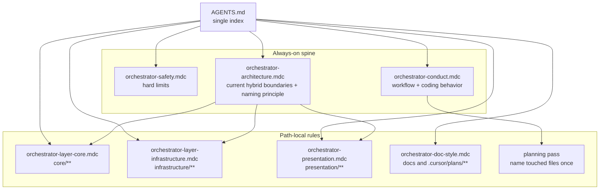

# Cursor rules restructure

## Target shape

This keeps architecture prominent, keeps behavior guidance in one place, and avoids rule-to-rule hopping. It also treats screaming architecture as a repo-wide naming rule, not a presentation-only feature.

## Why this shape is easier to read

- The always-on layer answers three different questions and stops there:
  - **Safety:** what the agent must not do.
  - **Architecture:** what this repo is, where code belongs, and what words the codebase should speak out loud.
  - **Conduct:** how to work in this repo without overbuilding or guessing.
- Path-local rules stay local. If you open `presentation/`, you get one presentation rule, not two related rules plus cross-references.
- Screaming architecture gets checked **once in planning** for every touched file across `core/`, `infrastructure/`, and `presentation/`, instead of asking the same naming question repeatedly during implementation.
- [AGENTS.md](../../../../Project/orchestrator_v4standalone/AGENTS.md) stays the only map of “which rule exists for what,” so the rules themselves do not need to point at each other.
- Future workflow ideas like GitHub Issues, Linear, or automation pipelines stay out of the rule set until they become real defaults.

## How screaming naming should work

- **Planning phase does the heavy lift:** when a task will add or rename files, the plan should name the target modules, route files, adapters, ports, and use cases up front.
- **Architecture keeps the global rule:** [orchestrator-architecture.mdc](../../../../Project/orchestrator_v4standalone/.cursor/rules/orchestrator-architecture.mdc) should say the whole repo should use interview-domain words and avoid empty names like `Service`, `Helper`, `Manager`, and `utils2`.
- **Layer rules keep only local examples:** [orchestrator-layer-core.mdc](../../../../Project/orchestrator_v4standalone/.cursor/rules/orchestrator-layer-core.mdc), [orchestrator-layer-infrastructure.mdc](../../../../Project/orchestrator_v4standalone/.cursor/rules/orchestrator-layer-infrastructure.mdc), and the merged presentation rule should show what that principle looks like in each layer.
- **Implementation does not re-litigate names unless the plan missed something:** if the plan already settled the names, the execution pass should follow it instead of reopening the naming debate on every file.

This is the clean split for your workflow: planning decides names across all layers; rules keep the codebase from drifting when work happens outside a full plan.

## Planned changes

### 1. Merge conduct and Karpathy

- **Do:** Move the durable coding-behavior guidance into [orchestrator-conduct.mdc](../../../../Project/orchestrator_v4standalone/.cursor/rules/orchestrator-conduct.mdc).
- **Keep:** short sections for ambiguity, simplicity, surgical changes, define done and verify, and stop when done.
- **Drop:** the long-form pointer from the rule if it adds more indirection than value.
- **What you should see:** one always-on behavior rule with clear short bullets, not two overlapping general rules.

### 2. Keep screaming naming global, but light in rules

- **Do:** keep the screaming architecture principle in [orchestrator-architecture.mdc](../../../../Project/orchestrator_v4standalone/.cursor/rules/orchestrator-architecture.mdc), not in a presentation-only rule.
- **Do:** add a short planning expectation to [orchestrator-conduct.mdc](../../../../Project/orchestrator_v4standalone/.cursor/rules/orchestrator-conduct.mdc): when a task adds or renames files, settle the names in the plan before implementation.
- **Do not:** create a big always-on naming checklist that repeats examples from every layer.
- **What you should see:** naming applies to the whole repo, but most naming judgment happens once during planning.

### 3. Thin architecture, do not demote it

- **Do:** Keep [orchestrator-architecture.mdc](../../../../Project/orchestrator_v4standalone/.cursor/rules/orchestrator-architecture.mdc) as an always-on rule because the repo boundaries matter and the architecture is still actively shaping the project.
- **Keep:** horizontal vs vertical slices, import direction, folder roles, `bootstrap.py` as composition root, and the port-plus-adapter pattern for new external capability.
- **Keep:** one short repo-wide naming statement so screaming architecture still covers `core/`, `infrastructure/`, and `presentation/`.
- **Remove:** direct “see this other rule” pointers inside the body unless a pointer is truly required.
- **What you should see:** one short boundary document that describes the current hybrid architecture without pretending it is finished.

### 4. Merge the presentation rules

- **Do:** Keep one merged [orchestrator-presentation.mdc](../../../../Project/orchestrator_v4standalone/.cursor/rules/orchestrator-presentation.mdc) rule for `presentation/**`.
- **Structure:** first section for route and bootstrap boundaries, second section for naming and static JS guidance.
- **What you should see:** one rule when editing `presentation/`, with no same-glob overlap and no sideways references.

### 5. Leave core and infrastructure separate

- **Do:** Keep [orchestrator-layer-core.mdc](../../../../Project/orchestrator_v4standalone/.cursor/rules/orchestrator-layer-core.mdc) and [orchestrator-layer-infrastructure.mdc](../../../../Project/orchestrator_v4standalone/.cursor/rules/orchestrator-layer-infrastructure.mdc) as separate files.
- **Why:** they already map cleanly to different trees, and each can keep one short naming reminder that matches its own kind of code.
- **What you should see:** path-local rules that stay short and only load where they matter.

### 6. Make AGENTS the only index

- **Do:** Update [AGENTS.md](../../../../Project/orchestrator_v4standalone/AGENTS.md) after the rule merge so the rule table matches the simplified set.
- **Do:** Check [orchestrator-doc-style.mdc](../../../../Project/orchestrator_v4standalone/.cursor/rules/orchestrator-doc-style.mdc) and remove any glob entry that reads like a dependency edge unless you still want style guidance when editing that rule file itself.
- **What you should see:** one human-facing map in AGENTS, while the rules stay focused on behavior and boundaries.

## Verification

1. Check the live rule folder.
   - **What to do:** Confirm `.cursor/rules/` contains `orchestrator-safety.mdc`, `orchestrator-architecture.mdc`, `orchestrator-conduct.mdc`, `orchestrator-layer-core.mdc`, `orchestrator-layer-infrastructure.mdc`, `orchestrator-presentation.mdc`, and `orchestrator-doc-style.mdc`.
   - **What you should see:** one merged presentation rule and no retired `karpathyrulesforcursor.mdc`, `orchestrator-layer-presentation.mdc`, or `orchestrator-screaming-presentation.mdc`.
2. Sweep active docs and modules for stale pointers.
   - **What to do:** Search `AGENTS.md`, `docs/`, `presentation/`, and `.cursor/rules/` for the retired rule filenames.
   - **What you should see:** no matches in live docs or modules. Backup files may still mention the old names.
3. Run repo tests.
   - **What to do:** From the repo root, run `pytest`.
   - **What you should see:** passing tests after the rule and doc changes.
4. Optional manual Cursor spot-check.
   - **What to do:** Open a file under `presentation/`, `core/`, and `infrastructure/` and look at Cursor’s active rules list.
   - **What you should see:** the always-on spine plus the matching path-local rule for that folder.

## Out of scope

- Adding GitHub Issues, Linear, or automation-pipeline policy to the rules.
- Changing team-kit or user-global rules outside this repo.
